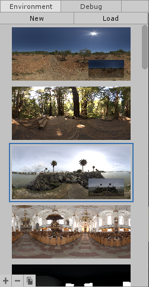
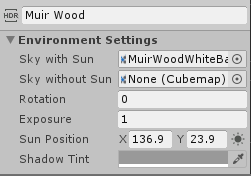

# Environment Library

An Environment Library is an Asset that contains a list of environments that you can use in [Look Dev](Look-Dev.html) to simulate different lighting conditions. Each environment uses an HDRI (High Dynamic Range Image) for its skybox and also includes properties that you can use to fine-tune the environment.

## Creating an Environment Library

To create an Environment Library Asset, either:

- Select **Assets > Create > Look Dev > Environment Library**.
- Open [Look Dev](Look-Dev.html) and click the **New Library** button.

## Creating and editing an environment

After you create an Environment Library, you can add environments to it which you can then use in Look Dev. To create environments or edit their properties, use the Look Dev window itself. To create and edit environments, you need to open an Environment Library in Look Dev. To do this, either:

- Go to the Look Dev window (menu: **Window > Render Pipeline > Look Dev**) and drag your Environment Library from your Project window into the sidebar.
- In your Project window, click on your Environment Library Asset. Then, in the Inspector, click the **Open in LookDev window** button.

If you already have environments in the Environment Library, you can see a list of them in the sidebar. When you click on any of the HDRI previews for an environment, a box appears at the bottom of the Environment Library list. This contains the selected environment's properties for you to edit. 

To add, remove, or duplicate environments, use the toolbar at the bottom of the Environment Library list, which contains the following buttons.

| **Button**                                                   | **Function**  | **Description**                                              |
| ------------------------------------------------------------ | ------------- | ------------------------------------------------------------ |
|  | **Add**       | Click this button to add a new environment to the bottom of the list. |
|  | **Remove**    | Click this button to remove the environment currently selected. Note that the environment that you have selected is the one with the blue frame. |
|                    | **Duplicate** | Click this button to duplicate the currently selected environment and add it as a new environment to the bottom of the list. |

## Properties

| **Property**        | **Description**                                              |
| ------------------- | ------------------------------------------------------------ |
| **Sky with Sun**    | Set the HDRI Texture that Look Dev uses for the sky lighting when using this environment. For information on how to import an HDRI Texture, see [Importing an HDRI Texture](#ImportingAnHDRI). |
| **Sky without Sun** | Set the HDRI Texture that Look Dev uses for compositing the shadows when simulating a sun in the view. If you do not assign this value, Look Dev uses a lower intensity version of the same HDRI Texture in **Sky with Sun**. For information on how to import an HDRI Texture, see [Importing an HDRI Texture](#ImportingAnHDRI). |
| **Rotation**        | Set the offset longitude that Look Dev applies for the whole sky and sun position. |
| **Exposure**        | Set the exposure that Look Dev uses when it renders the environment. |
| **Sun Position**    | Set the position of the sun when compositing the shadows. The Sun button at the end of the line automatically places the sun on the brightest spot of the **Sky with Sun** HDRI Texture. |
| **Shadow Tint**     | Use the color picker to set the color of the tint that Look Dev uses to color shadows. |

## Importing an HDRI Texture

To import an HDRI Texture into the Unity Editor, load an **.hdr** or **.exr** file into your Unity Project like you would any other image. In the Texture Importer Inspector window, set **Texture Type** to **Default**, set **Texture Shape** to **Cube**, and set **Convolution Type** to **None**.

When you want to test an HDRI Texture Asset or a skybox cube map Material, drag and drop it into the Look Dev view.