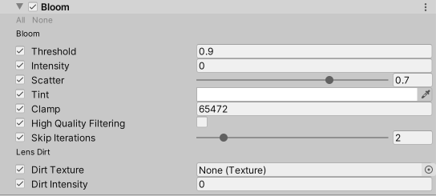

# Bloom

The Bloom effect creates fringes of light extending from the borders of bright areas in an image. This creates the illusion of extremely bright light overwhelming the Camera.

The Bloom effect also has a **Lens Dirt** feature, which you can use to apply a full-screen layer of smudges or dust to diffract the Bloom effect.

## Using Bloom

**Bloom** uses the [Volume](Volumes.md) system, so to enable and modify **Bloom** properties, you must add a **Bloom** override to a [Volume](Volume.md) in your Scene. 

To add **Bloom** to a Volume:

1. In the Scene or Hierarchy view, select a GameObject that contains a Volume component to view it in the Inspector.
2. In the Inspector, navigate to **Add Override** &gt; **Post-processing**, and click on **Bloom**. Universal Render Pipeline applies **Bloom** to any Camera this Volume affects.

## Properties

### Bloom

| **Property**               | **Description**                                              |
| -------------------------- | ------------------------------------------------------------ |
| **Threshold**              | Set the gamma space brightness value at which URP applies Bloom. URP does not apply Bloom to any pixels in the Scene that have a brightness lower than this value. The minimum value is 0, where nothing is filtered. The default value is 0.9. There is no maximum value. |
| **Intensity**              | Set the strength of the Bloom filter, in a range from 0 to 1. The default is 0, which means that the Bloom effect is disabled.  |
| **Scatter**                | Set the radius of the bloom effect in a range from 0 to 1. Higher values give a larger radius. The default value is 0.7. |
| **Tint**                   | Use the color picker to select a color for the Bloom effect to tint to. |
| **Clamp**                  | Set the maximum intensity that Unity uses to calculate Bloom. If pixels in your Scene are more intense than this, URP renders them at their current intensity, but uses this intensity value for the purposes of Bloom calculations. The default value is 65472. |
| **High Quality Filtering** | Enable this to use high quality sampling. This reduces flickering and improves the overall smoothness, but is more resource-intensive and can affect performance. |
| **Skip Iterations** | The last iterations in the processing sequence might have little contribution to the appearance of the rendered frame. In this setting you define the number of final iterations to skip. Increasing this value reduces processing load and increases performance, especially on mobile devices. The default value is 2. |

### Lens Dirt

| **Property**  | **Description**                                              |
| ------------- | ------------------------------------------------------------ |
| **Texture**   | Assign a Texture to apply the effect of dirt (such as smudges or dust) to the lens. |
| **Intensity** | Set the strength of the **Lens Dirt** effect.                    |

## Troubleshooting performance issues

There are multiple ways to improve the performance impact of Bloom. Listed in order of effectiveness, you can: 

1. Disable **High Quality Filtering**. Bloom then uses bilinear filtering instead of bicubic. This reduces the overall smoothness of the Bloom effect, but greatly improves performance, especially on lower-end hardware and platforms. In some extreme cases, you might see blocky graphical artifacts in your Scene. 
2. Use a lower resolution **Lens Dirt** Texture to reduce memory pressure and speed up blending across volumes.

