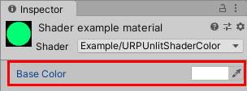
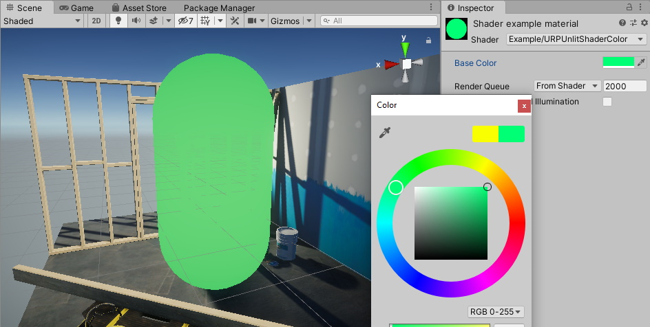

# URP unlit shader with color input

The Unity shader in this example adds the __Base Color__ property to the Material. You can select the color using that property and the shader fills the mesh shape with the color.

Use the Unity shader source file from section [URP unlit basic shader](writing-shaders-urp-basic-unlit-structure.md) and make the following changes to the ShaderLab code:

1. Add the `_BaseColor` property definition to the Properties block:
    
    ```c++
    Properties
    { 
        _BaseColor("Base Color", Color) = (1, 1, 1, 1)
    }
    ```
    
    This declaration adds the `_BaseColor` property with the label __Base Color__ to the Material:

     

    The `_BaseColor` property name is a reserved name. When you declare a property with this name, Unity uses this property as the [main color](https://docs.unity3d.com/ScriptReference/Material-color.html) of the Material. 

2. When you declare a property in the Properties block, you also need to declare it in the HLSL code. 
    
    > __NOTE__: To ensure that the Unity shader is SRP Batcher compatible, declare all Material properties inside a single `CBUFFER` block with the name `UnityPerMaterial`. For more information on the SRP Batcher, see the page [Scriptable Render Pipeline (SRP) Batcher](https://docs.unity3d.com/Manual/SRPBatcher.html).
    
    Add the following code before the vertex shader:

    ```c++
    CBUFFER_START(UnityPerMaterial)
        half4 _BaseColor;            
    CBUFFER_END
    ```

3. Change the code in the fragment shader so that it returns the `_BaseColor` property.

    ```c++
    half4 frag() : SV_Target
    {
        return _BaseColor;
    }
    ```

Now you can select the color in the **Base Color** field in the Inspector window. The fragment shader fills the mesh with the color you select.



Below is the complete ShaderLab code for this example.

```c++
// This shader fills the mesh shape with a color that a user can change using the
// Inspector window on a Material.
Shader "Example/URPUnlitShaderColor"
{    
    // The _BaseColor variable is visible in the Material's Inspector, as a field 
    // called Base Color. You can use it to select a custom color. This variable
    // has the default value (1, 1, 1, 1).
    Properties
    { 
        _BaseColor("Base Color", Color) = (1, 1, 1, 1)
    }
    
    SubShader
    {        
        Tags { "RenderType" = "Opaque" "RenderPipeline" = "UniversalPipeline" }
                
        Pass
        {            
            HLSLPROGRAM
            #pragma vertex vert
            #pragma fragment frag

            #include "Packages/com.unity.render-pipelines.universal/ShaderLibrary/Core.hlsl"            
            
            struct Attributes
            {
                float4 positionOS   : POSITION;                 
            };

            struct Varyings
            {
                float4 positionHCS  : SV_POSITION;
            };

            // To make the Unity shader SRP Batcher compatible, declare all
            // properties related to a Material in a a single CBUFFER block with 
            // the name UnityPerMaterial.
            CBUFFER_START(UnityPerMaterial)
                // The following line declares the _BaseColor variable, so that you
                // can use it in the fragment shader.
                half4 _BaseColor;            
            CBUFFER_END

            Varyings vert(Attributes IN)
            {
                Varyings OUT;
                OUT.positionHCS = TransformObjectToHClip(IN.positionOS.xyz);
                return OUT;
            }

            half4 frag() : SV_Target
            {
                // Returning the _BaseColor value.                
                return _BaseColor;
            }
            ENDHLSL
        }
    }
}
```

Section [Drawing a texture](writing-shaders-urp-unlit-texture.md) shows how to draw a texture on the mesh.
